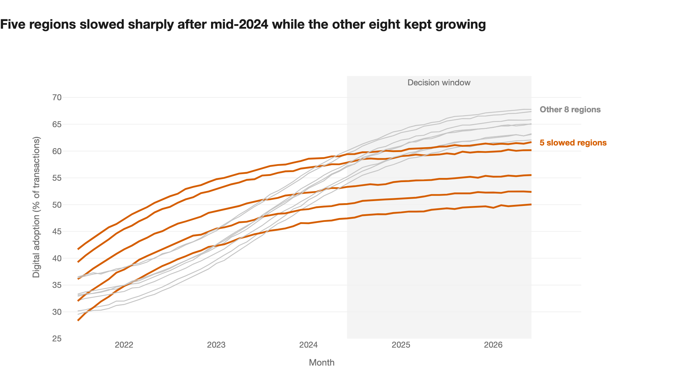
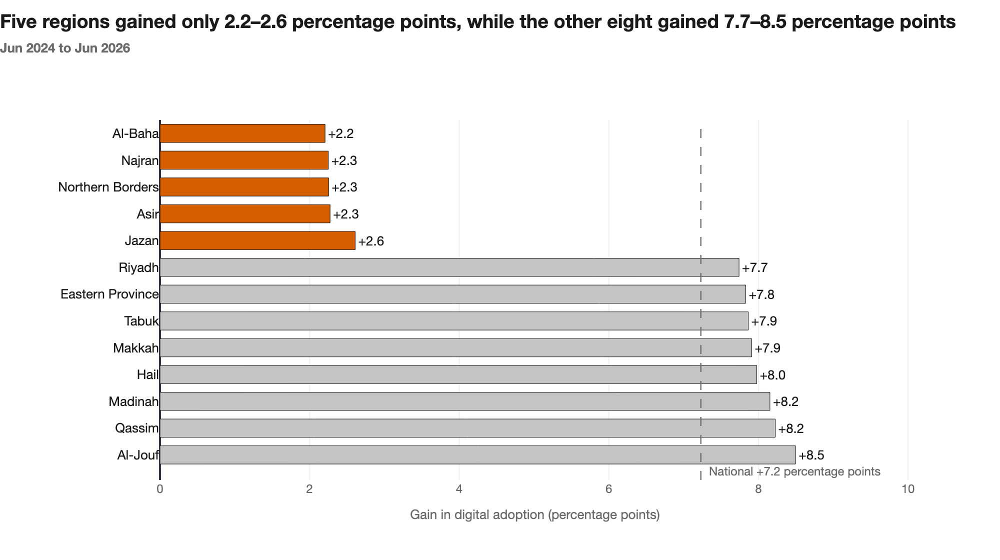

# Capstone: A decision from Tayseer data

> **Project:** Which regions should Tayseer review first?\
> **Course:** Data Visualization and Storytelling\
> **Programme:** [SDAIA Academy](https://github.com/SDAIAAcademy)\
> **Student:** Sama Sultan A Alzahrani\
> **Dataset:** [tayseer_services.csv](data/tayseer_services.csv)
---

## Bottom line

> Digital-adoption growth has **slowed sharply in five regions** — Al-Baha, Najran, Northern Borders, Asir and Jazan — while the other eight continued to grow much faster.
> Between June 2024 and June 2026 these five gained **2.2–2.6 percentage points** each; every other region gained **7.7–8.5 percentage points**.\
> **Recommendation:** review these five regions before the next round of digital-adoption support is allocated.

---

## Project description

Tayseer is moving government services in Saudi Arabia from branches to digital channels. Nationally, digital adoption rose from **56.7%** in June 2024 to **64.0%** in June 2026, which looks like steady progress.

This project asks whether every region shares in that progress. It measures how much each region's adoption **grew** over the latest 24 months, rather than where each region stands today. Measuring growth reveals something the national average hides: five regions have experienced a sharp slowdown.

## Decision framing

| | |
|---|---|
| **Audience / decision-maker** | Tayseer Program Director (national), who decides which regions receive the next round of digital-adoption support |
| **Decision question** | Which regions should be prioritised for a digital-adoption review, because their growth has slowed sharply while the rest of the country keeps growing? |
| **Scope** | All 13 regions and 9 service categories, Jul 2021 – Jun 2026. Decision window: **Jun 2024 → Jun 2026** |
| **Main metric** | Change in digital adoption, in **percentage points (pp)** |

**Why growth rather than level?** A cut-off such as "below 65%" flags nine regions in June 2026, including Madinah, Makkah and Al-Jouf, which are still gaining about 8 points every two years. A level ranking cannot separate regions that are *behind but moving* from regions that have *nearly stopped moving*.

---

## Metric and aggregation

`digital_adoption_pct` is identical across the four channel rows of each month × region × category. The notebook **proves this on all 7,020 cells** before relying on it, then counts each value once. Summing the raw column would count every value four times.

Region-level adoption is a **transaction-weighted mean** of that region's nine category cells:

```
adoption = Σ(adoption_cell × transactions_cell) ÷ Σ(transactions_cell)
```

Transactions are counts and can be summed; percentages cannot. All changes are reported in **percentage points (pp)** — the arithmetic difference between two percentages, not a percent change.

**The rule for "slowed", fixed before ranking any region:** a region counts as slowed if its 24-month gain is **less than half the national gain** (< 3.62 pp). The five regions are identified by that rule in code, not hand-picked.

---

## Findings

### 1. Five regions slowed sharply after mid-2024



They continued to increase, but much more slowly than the other eight regions. They are **not** the lowest lines on the chart — Madinah starts lower and later overtakes them — which is exactly why a ranking by level would miss this.

### 2. The gap is large and has no middle ground



| | 2-year gain (Jun 24 → Jun 26) | Last 12 months |
|---|---:|---:|
| **Five slowed regions** | **+2.2 to +2.6 pp** | **+0.6 to +0.9 pp** |
| Other eight regions | +7.7 to +8.5 pp | +2.1 to +2.3 pp |
| National | +7.2 pp | — |

Nothing falls between 2.6 and 7.7 pp, so this is a clear separation rather than a gradual spread. On average the other eight gained about **3.5 times** as many percentage points.

### 3. Three checks that could have overturned it

| Check | Result |
|---|---|
| **Does the weighting matter?** | Weighting by transactions, by unique users, or not at all gives the same answer within 0.1 pp per region |
| **Is it one weak service?** | No. Inside the five regions, **every** one of the nine categories gained ≤ 3.2 pp; everywhere else **every** category gained ≥ 7.0 pp |
| **Are they too small to matter?** | They handled **15.6%** of national transactions in the 12 months to June 2026 — about 23.1 million transactions |

---

## Recommendation

1. **Prioritise Al-Baha, Najran, Northern Borders, Asir and Jazan** for a digital-adoption review before the next support round is allocated. The review should establish *why* uptake slowed — for example access, awareness, or whether services can be completed end-to-end on digital channels.
2. **Add 12-month adoption change per region to routine monitoring**, so a slowdown becomes visible early instead of being hidden inside a rising national average.

## Limitation

The data shows **that** growth slowed, not **why**. A plausible alternative explanation is a ceiling effect: these regions grew fastest in the early years and may already have reached the residents who move to digital channels most readily, in which case more of the same promotion would not help. The dataset holds no variable that would distinguish that from a service or access problem, which is why the recommendation is a review rather than a specific intervention. A correlation between this slowdown and any other metric in the file would not establish cause. `digital_adoption_pct` is also undefined in the data dictionary; it tracks the digital share of transactions very closely but is not identical to it.

---

## Chart choices

Chart 1 answers *"how has this changed over time?"*, so it is a **line chart**: time maps to position on the x-axis and value to position on a common y-scale, the most accurately decoded encoding. Thirteen coloured lines would be a spaghetti chart, so the five slowed regions are drawn in one accent colour with the rest in grey, labelled directly on the plot instead of through a legend. Chart 2 answers *"which regions gained least?"*, a ranking question, so it is a **sorted horizontal bar chart** with a zero baseline, a value label on every bar and a dashed national reference line that turns the numbers into a judgement — above or below the national pace. Colour is redundant with position in both charts, so they still work in greyscale and for colour-blind readers.

## AI verification note

I used an AI assistant to help plan the analysis and draft code and wording. I checked the work myself: I re-ran the notebook from a clean kernel; I confirmed in code that adoption repeats identically across all four channels in every one of the 7,020 cells before de-duplicating; I reproduced the headline figures (national +7.2 pp; 2.2–2.6 pp against 7.7–8.5 pp per region) against the printed tables; I confirmed the finding survives three different weighting methods and holds in all nine service categories; and I compared every label on both charts against the notebook output.


---

## How to run

**Google Colab**
1. Open `tayseer_analysis.ipynb` in Colab.
2. Upload `tayseer_services.csv` through the Files panel on the left.
3. **Runtime → Run all**.

**Locally**
```bash
git clone https://github.com/Samm-006/Tayseer.git
cd Tayseer
pip install -r requirements.txt
jupyter notebook tayseer_analysis.ipynb
```

The chart images in this README are saved in `charts/`. To regenerate them, run the notebook and use the camera icon on each chart to download it as a PNG.

## Repository structure

```
Tayseer/
├── README.md                          
├── tayseer_analysis.ipynb             # Full, rerunnable analysis
├── requirements.txt                   # pandas, plotly
├── data/
│   └── tayseer_services.csv           # Supplied dataset
└── charts/
    ├── chart1_adoption_trend.png      # Chart 1 — change over time
    └── chart2_region_gain.png         # Chart 2 — comparison between groups
```

---

<sub>SDAIA Academy · Data Visualization and Storytelling · Tayseer capstone</sub>